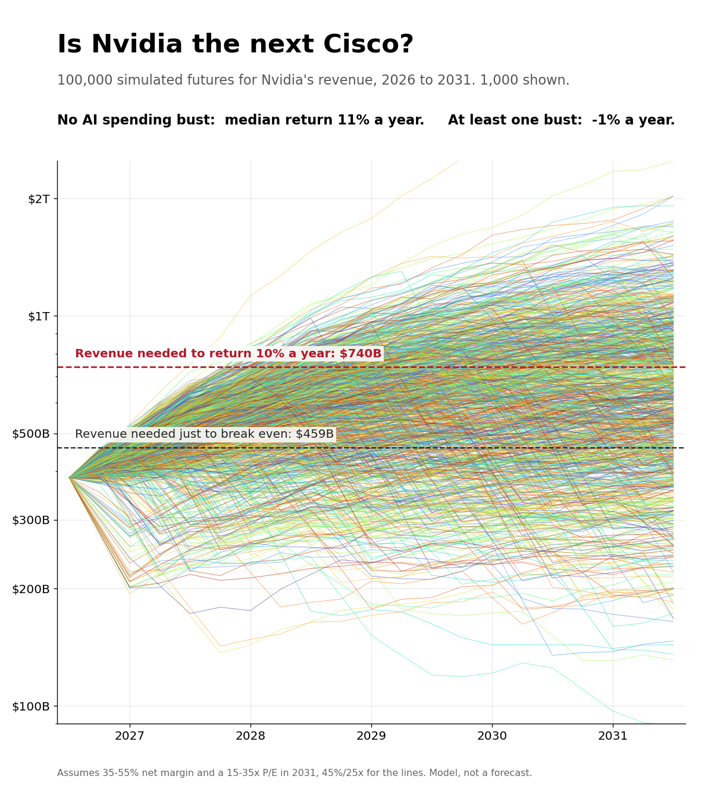

# Is Nvidia the Next Cisco?

A Monte Carlo test of the AI trade. By Jacob Rodan, Tel Aviv, September 2026.

In March 2000, Cisco was the most valuable company in the world. Its business kept growing, but its stock took 25 years to get back to its peak. Nvidia holds the same position in AI today. This project simulates 100,000 five-year futures for Nvidia's revenue, profit margins and valuation, including the chance of a Cisco-style AI spending bust, to test whether today's buyers face the same risk.

**Read the paper:** [Is_Nvidia_the_Next_Cisco.pdf](Is_Nvidia_the_Next_Cisco.pdf) (4 pages)



## Results (100,000 simulations)

| Outcome over five years | Result |
|---|---|
| Median annual return | 5.5% |
| Chance of losing money | 32% |
| Chance of beating 10% a year | 35% |
| Futures with no AI spending bust (median) | 11% a year |
| Futures with at least one bust (median) | -1% a year |
| Bust chance at which the median return falls below 10% a year | about 2.4% a year |

**Verdict:** not the next Cisco on price, but possibly on the cycle.

## Run it yourself

```
pip install numpy matplotlib reportlab
python build.py    # runs the simulation and makes the figures
python paper.py    # writes the PDF
```

All assumptions (growth, fade rate, bust probability, margins, P/E) live in `model.py`. Change them and rerun to see how the answer moves.

## Data

NVIDIA and Cisco SEC filings (10-K, 10-Q, 8-K); market data as of September 25-26, 2026. Full references are in the paper.

*This is a model of what has to be true, not a forecast, and not investment advice.*
